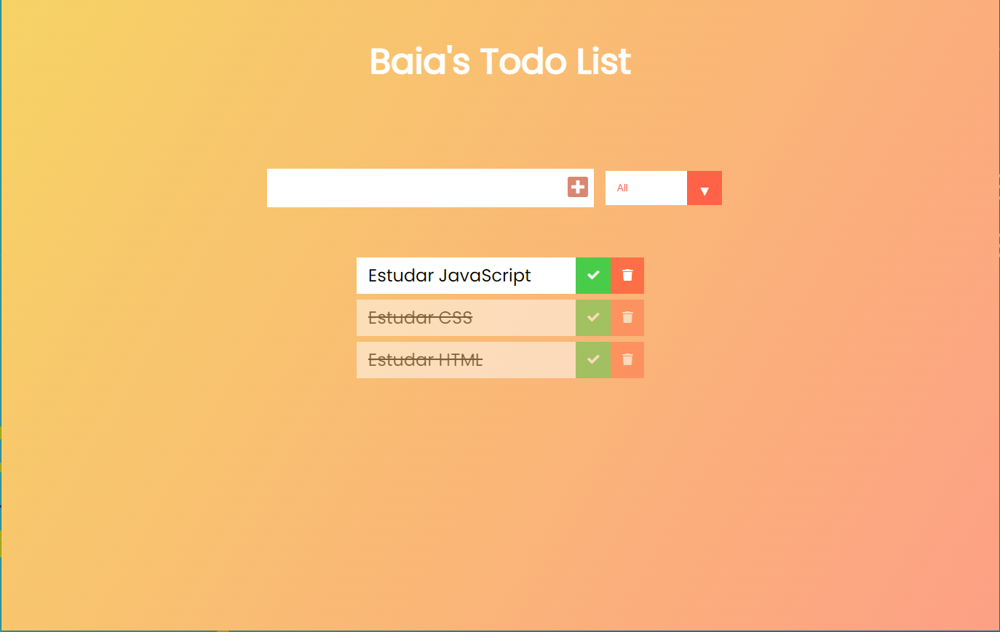

# Todo List App

## Descrição

Este desafio tem como objetivo praticar habilidades de manipulação da DOM totalmente em javaScript.

#### Layout do projeto



## Começando

Para rodar esse projeto na sua maquina, é necessário ter duas ferramentas instaladas em sua máquina, o [Git](https://git-scm.com/) e o [Node.js](https://nodejs.org/).

- Clone o projeto com os comando abaixo:
```
$ https://github.com/thiagobaia/todo-list-vanilla.git

$ cd todo-list-vanilla
```

- Logo após, instale todas as dependencias com:
```
$ npm i
```

### Tecnologias e bibliotecas usadas no projeto: 
```
- HTML  
- CSS
- JavaScript Vanilla
```
